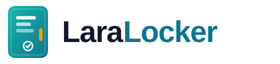

<p align="center">
  <picture>
    <source media="(prefers-color-scheme: dark)" srcset="art/logo-dark.svg">
    
  </picture>
</p>

<p align="center">
<a href="https://github.com/ijeffro/laralocker/actions/workflows/tests.yml"></a>
<a href="https://github.com/ijeffro/laralocker/actions/workflows/tests.yml"></a>
<a href="https://github.com/ijeffro/laralocker/actions/workflows/static-analysis.yml"></a>
<a href="https://github.com/ijeffro/laralocker/actions/workflows/code-style.yml"></a>
<br>
<a href="https://packagist.org/packages/ijeffro/laralocker"></a>
<a href="https://packagist.org/packages/ijeffro/laralocker"></a>
<a href="composer.json"></a>
<a href="composer.json"></a>
<a href="https://github.com/adlnet/xAPI-Spec"></a>
<a href="LICENSE.md"></a>
</p>

<p align="center">A Laravel API connector for <a href="https://docs.learninglocker.net/">Learning Locker®</a>, the open-source Learning Record Store.</p>

LaraLocker talks to Learning Locker's two HTTP APIs from Laravel:

- the **management API** (`/api/v2/…`) for stores, clients, users, personas, queries, dashboards and the rest;
- the **xAPI endpoint** (`/data/xAPI/…`) for sending and reading statements.

It is only a connector. It adds no routes, controllers, migrations or database tables to your app.

## Requirements

- PHP 8.2+
- Laravel 12 or 13
- A Learning Locker v2+ install (self-hosted or SaaS) and a client key/secret

## Installation

```bash
composer require ijeffro/laralocker
```

In Learning Locker, open **Settings → Clients**, create a client, and give it the scopes you need: **API All** for the management API, and **xAPI All** (or xAPI read/write) for statements. Then add it to `.env`:

```env
LEARNING_LOCKER_URL=https://your-learning-locker.example.com
LEARNING_LOCKER_KEY=your-client-key
LEARNING_LOCKER_SECRET=your-client-secret
```

`LEARNING_LOCKER_URL` is the root of the install, without `/api` or `/data/xAPI`.

To change the timeout, the xAPI language or the account home page, publish the config:

```bash
php artisan vendor:publish --tag=laralocker-config
```

Check the connection:

```php
use LearningLocker;

LearningLocker::ping();        // true when Learning Locker answers
LearningLocker::clientInfo();  // the client these credentials belong to, with its scopes
```

## Management API

Plural methods address the collection. Singular methods take a Learning Locker `_id`.

```php
LearningLocker::stores()->get();                       // every store (LRS)
LearningLocker::store($id)->get();                     // one store
LearningLocker::store($id)->get(['_id', 'title']);     // only some fields
LearningLocker::store()->create(['title' => 'Main']);
LearningLocker::store($id)->update(['title' => 'Renamed']);
LearningLocker::store($id)->delete();
```

Filter, sort and page with MongoDB-style arguments:

```php
LearningLocker::clients()
    ->where(['lrs_id' => $storeId])
    ->sort(['createdAt' => -1])
    ->skip(20)
    ->limit(10)
    ->get();

LearningLocker::personas()->where(['name' => 'Jane Doe'])->first();
LearningLocker::personas()->count();
```

For large collections, use Learning Locker's cursor-based connection API:

```php
$page = LearningLocker::personas()->paginate(first: 100);

while ($page['pageInfo']['hasNextPage']) {
    $page = LearningLocker::personas()->paginate(100, $page['pageInfo']['endCursor']);
}
```

| Method | Learning Locker model |
| --- | --- |
| `organisations()` / `organisation($id)` | `/api/v2/organisation` |
| `stores()` / `store($id)` | `/api/v2/lrs` |
| `clients()` / `client($id)` | `/api/v2/client` |
| `users()` / `user($id)` | `/api/v2/user` |
| `roles()` / `role($id)` | `/api/v2/role` |
| `queries()` / `query($id)` | `/api/v2/query` |
| `dashboards()` / `dashboard($id)` | `/api/v2/dashboard` |
| `visualisations()` / `visualisation($id)` | `/api/v2/visualisation` |
| `exports()` / `export($id)` | `/api/v2/export` |
| `downloads()` / `download($id)` | `/api/v2/download` |
| `statementForwarding($id)` | `/api/v2/statementforwarding` |
| `personas()` / `persona($id)` | `/api/v2/persona` |
| `personaIdentifiers()` / `personaIdentifier($id)` | `/api/v2/personaIdentifier` |
| `personaAttributes()` / `personaAttribute($id)` | `/api/v2/personaattribute` |
| `personaImports()` / `personaImport($id)` | `/api/v2/personasimport` |
| `statements()` / `statement($id)` | `/api/v2/statement` (read and delete only) |
| `resource($model, $id)` | any other model, e.g. Enterprise-only `journey` |

Run an aggregation over the organisation's statements:

```php
LearningLocker::aggregate([
    ['$match' => ['statement.verb.id' => 'http://adlnet.gov/expapi/verbs/completed']],
    ['$group' => ['_id' => '$statement.object.id', 'count' => ['$sum' => 1]]],
], ['maxTimeMS' => 5000]);
```

To use more than one Learning Locker client, pass other credentials:

```php
LearningLocker::connect($url, $key, $secret)->stores()->get();
```

## xAPI statements

Build and send a statement:

```php
use xAPI;

$id = xAPI::actor(['name' => 'Jane Doe', 'email' => 'jane@example.com'])
    ->did('completed')
    ->what('https://example.com/courses/intro', 'Introduction', 'http://adlnet.gov/expapi/activities/course')
    ->scored(['score' => ['scaled' => 0.9], 'success' => true, 'completion' => true])
    ->context(['platform' => 'My app'])
    ->send();
```

- `actor()` takes `['name', 'email']`, `['name', 'account' => $userId]` (which uses the configured home page), or a full xAPI agent.
- `did()` takes an ADL verb name (`completed`, `passed`, `launched`…), a verb IRI, or a full xAPI verb.
- `what()` takes an activity IRI with an optional name, type and description, or a full xAPI object.
- `make()` returns the statement as an array without sending it.

Send statements you have already built, one at a time or in a batch:

```php
LearningLocker::statements()->send([$statement, $anotherStatement]);
```

Read statements back:

```php
xAPI::statements(['agent' => ['email' => 'jane@example.com'], 'limit' => 10]);
xAPI::statement($statementId);
xAPI::more($page['more']);
```

## Errors

Any 4xx or 5xx from Learning Locker throws `Ijeffro\Laralocker\Exceptions\LearningLockerException`. `$e->status()` gives the HTTP status, and `$e->response` holds the full response.

```php
try {
    LearningLocker::store($id)->get();
} catch (LearningLockerException $e) {
    if ($e->status() === 404) {
        // no such store
    }
}
```

A 401 means the key or secret is wrong, or the client has been disabled. A 403 means the client lacks the scope for that call.

## Testing

```bash
composer test            # PHPUnit
composer test-coverage   # PHPUnit with a coverage report (needs pcov or Xdebug)
composer lint            # Pint
composer analyse         # PHPStan, level 8
```

On every push and pull request, CI runs the following:

- **tests:** PHPUnit on PHP 8.2–8.5 × Laravel 12–13, each against the lowest and the latest dependencies;
- **coverage:** fails below 100% line coverage;
- **static analysis:** PHPStan level 8;
- **code style:** Pint.

The tests fake Learning Locker with `Http::fake()`, so they need no credentials. You can fake it the same way in your own app:

```php
Http::fake(['your-learning-locker.example.com/api/v2/lrs*' => Http::response([['_id' => '1']])]);
```

## Upgrading from 1.x or 2.x

Version 3 is a rewrite. It keeps the facade calls but drops everything that wasn't the API client. See the [CHANGELOG](CHANGELOG.md) and the [Upgrade guide](https://github.com/ijeffro/laralocker/wiki/Upgrade-guide).

## More

- [Wiki](https://github.com/ijeffro/laralocker/wiki)
- [Changelog](CHANGELOG.md)
- [Contributing](CONTRIBUTING.md)

Please report security issues privately through [GitHub security advisories](https://github.com/ijeffro/laralocker/security/advisories/new), not the issue tracker.

## Credits

- [Phil Graham](https://github.com/ijeffro)
- [All contributors](../../contributors)

## License

MIT. See the [license file](LICENSE.md).

Learning Locker® is a registered trademark of Learning Pool. This package is not affiliated with Learning Pool.
